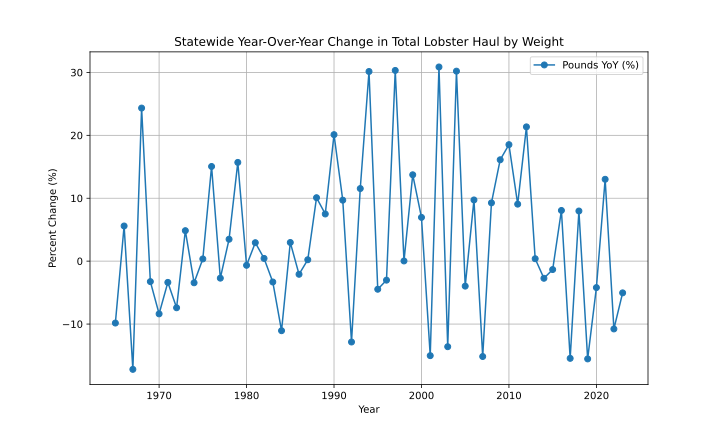

# Lobster Hauls
I may be from Ohio, but I have a close relationship with Maine's lobster fishery. Every summer since 1989, my family and I have gathered on Cabbage Island, where we host daily traditional Downeast clambakes for 180 guests. Maine has one of the healthiest fisheries in the region due to its tough and longstanding regulations. Maine was the first state to enforce a standard minimum and maximum on lobster catches. This means that if a lobster is too small or too large, it must be returned to the ocean. This has been the way for over 100 years.

As the Gulf of Maine continues to warm, there is concern that lobsters will become less prevalent in Maine waters as they migrate further north. Out of curiosity, I scoured the internet for annual landing data and found [this](https://www.maine.gov/dmr/sites/maine.gov.dmr/files/inline-files/lobster.county_0.pdf) from Maine's Department of Marine Resources. The record tracks lobster hauls by county going back to 1950 and includes the weight and value of the lobster haul.

# About the Data
County-level data for this project was retrieved from the Department of Marine Resources for the State of Maine and is the report of commercial lobster landings by county and by year. The database has 511 entries from 1964 to 2023 and covers the pounds caught and the value of that year's haul.

Counties covered by this report are seven coastal Maine counties: York, Cumberland, Sadahoc, Lincoln, Knox, Washington, and Hancock.

Weights in this report are recorded in pounds, and the y-axis on the visualizations is scaled to reflect this. 
Values are recorded in dollars. 

Source: [Maine Department of Marine Resources](https://www.maine.gov/dmr/sites/maine.gov.dmr/files/inline-files/lobster.county_0.pdf)

Higher-level data was retrieved from NOAA going back to 1950, but at this time, the data is unused in this project. Future research with this dataset will include analyzing fishery patterns over time beyond just lobster.

# Results

### Value of Annual Lobster Haul by County

### Pounds of Lobster Caught by County

### Combined Revenue Data

### Total Lobster Value in Pounds Over Time

### Price Per Pound per County

### Statewide Price Per Pound

### Statewide Year-Over-Year Changes in Reported Poundage

### Statewide Year-Over-Year Changes in Fishery Value

### County Level Year-Over-Year Changes in Reported Poundage

### Statewide Year-Over-Year Changes in Fishery Value per County
